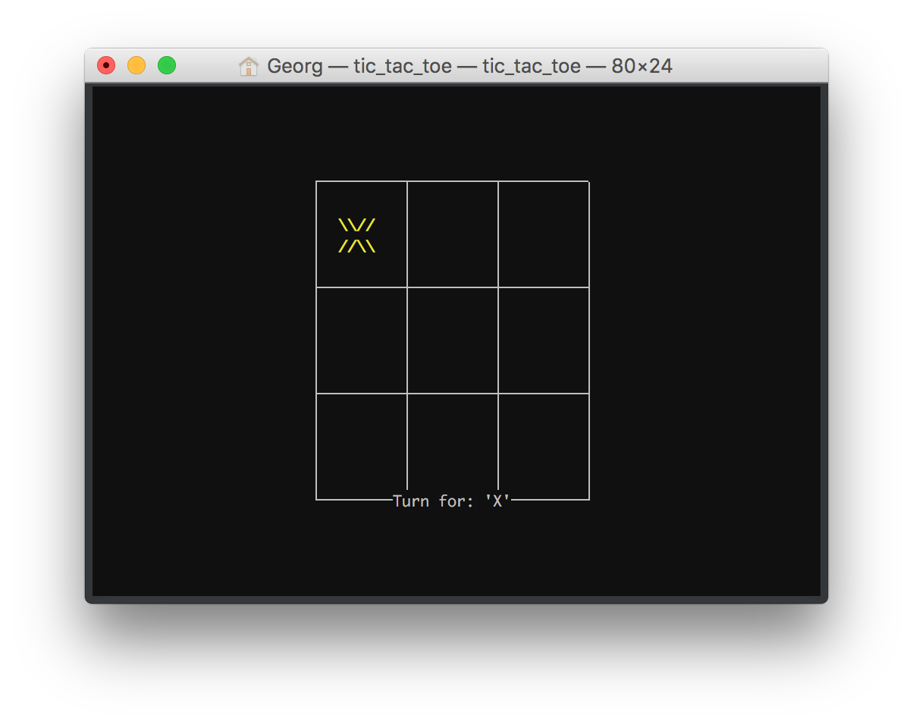
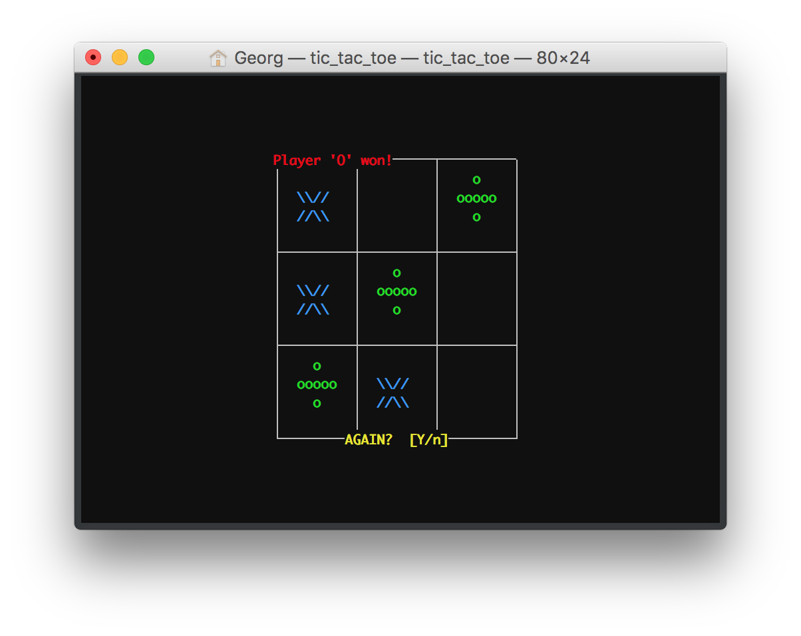

# Tic-Tac-Toe-AI
A perfect tic tac toe AI game by use of a graph.

# Controls
The controls to navigate on the board are the arrow keys. To place a stone press enter, to play with against your friend deactivate the AI with <i>s</i>.

# GUI
The GUI in ncurses is hold simple, but supports a rescaling of the window, by scaling the UI elements.

 
The starting screen.  

 
An example winning screen. In this case the AI won.

# Disclaimer
This was just a simple test and the first program writen in C++ by me. It has some bugs with the memory, because I learned the important things about C++ memory allocations later in the second project in the same language <i><a href="https://github.com/Gansgar/Slider-Game">Slider Game</a></i>. 
